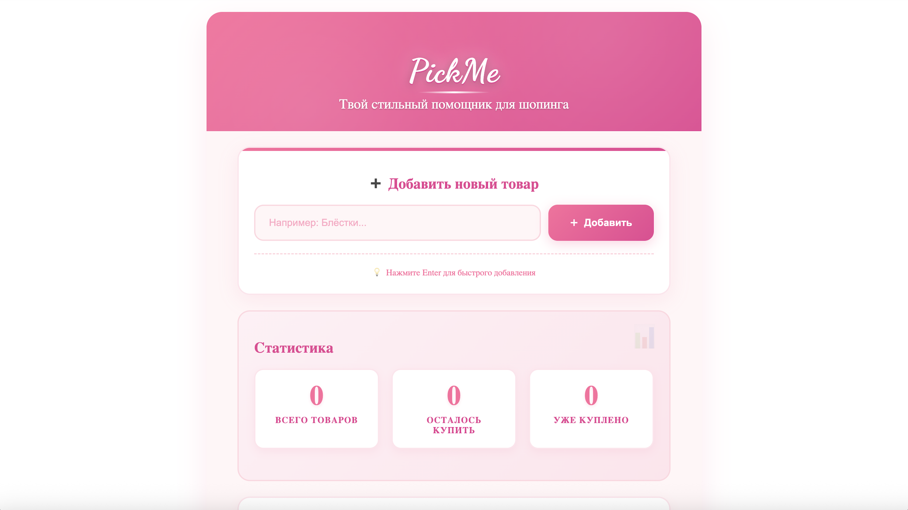
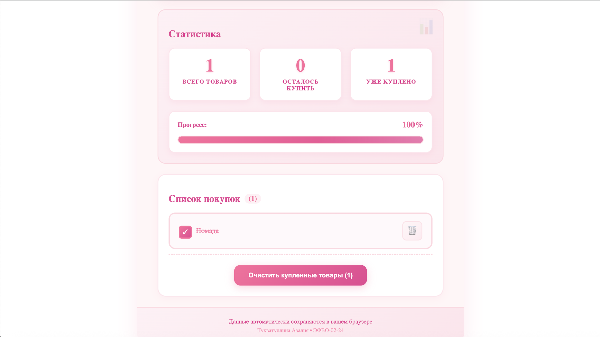
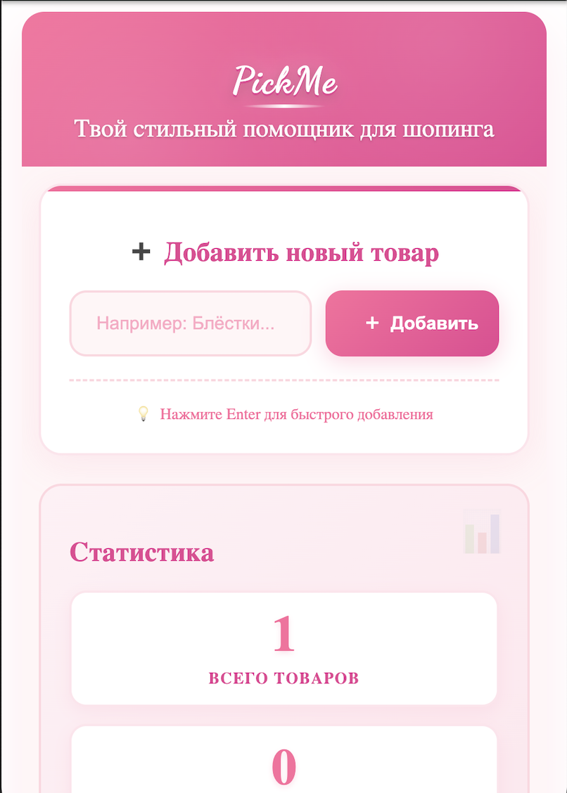
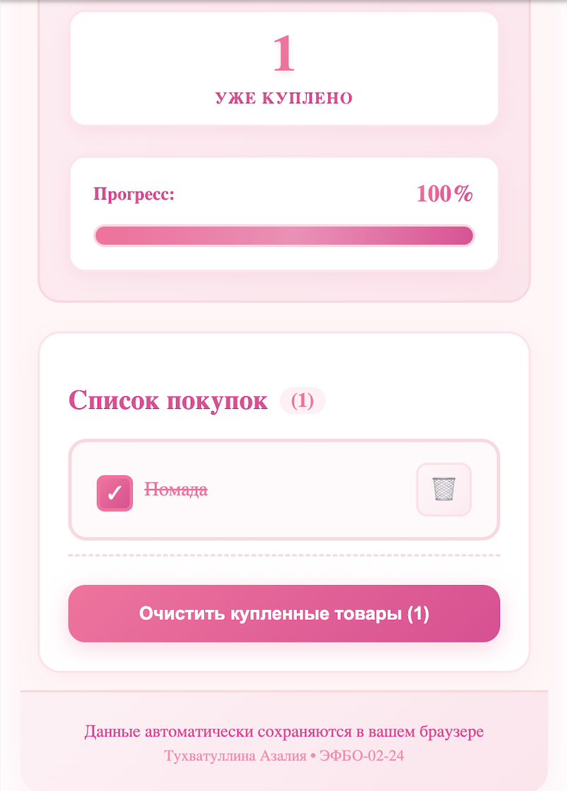

# PickMe список покупок 💅🏻

### [Сcылка на сайт](https://azaleat0101.github.io/shopping-list-app/)

React-приложение для управления списком покупок с розовой тематикой в стиле Барби. Сделала Тухватуллина Азалия, ЭФБО-02-24 (предмет "Технологии индустриального программирования").

### Скрины на компе

### Скрины на мобилке

### Особенности
- **Розовая тема** в стиле Барби с градиентами и анимациями
- **Добавление товаров** с валидацией 
- **Отметка купленного** с кастомными чекбоксами
- **Автосохранение** в localStorage браузера
- **Визуальная статистика** с прогресс-баром
- **Адаптивный дизайн** для всех устройств
- **Плавные анимации** и интерактивные элементы

### Предварительные требования
- Node.js 16.x или выше
- npm или yarn

### Технологии
- React 18 - библиотека для построения UI
- React Hooks (useState, useEffect) - управление состоянием
- CSS3 - Flexbox, Grid, анимации, градиенты
- LocalStorage API - сохранение данных в браузере
- Google Fonts - шрифт Dancing Script

### Адаптивность
Приложение полностью адаптивно и корректно отображается на:
- Настольных компьютерах (от 1200px)
- Планшетах (768px - 1199px)
- Смартфонах (до 767px)

## Спасибо за внимание! 🌟
